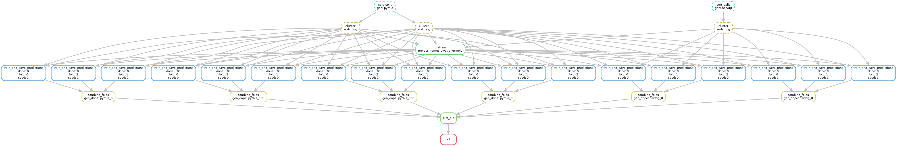

<div align="center">

# LowStrongCwolang CWoLA

[](https://pytorch.org/)
[](https://lightning.ai/)
[](https://hydra.cc/)
[](https://wandb.ai)

</div>

## Table of Contents
- [Overview](#overview)
- [Project Structure](#project-structure)
- [Installation](#installation)
  - [Required Python Packages](#required-python-packages)
    - [Docker / Apptainer](#docker--apptainer)
    - [Via Pip](#via-pip)
- [Usage](#usage)
  - [Dataset Setup](#dataset-setup)
  - [Training](#training)
  - [Workflow](#workflow)
- [License](#license)

## Overview

This repository produces binary classifiers on low-level jet information where the background is made of an impure mixture: signal vs (signal + background).
The project utilizes the transformer architecture with modern techniques (FlashAttention/LayerScale/ContextModulation/etc).

This repo uses `PyTorch` and `Lightning` to facilitate training and evaluation of the model, `Hydra` for configuration management, `Weights-and-Biases` for logging, and `Snakemake` for workflow management.

Additionally, some models require [FlashAttention](https://github.com/Dao-AILab/flash-attention) to operate, which necessitates running on Nvidia Ampere (or later) GPUs.

## Project Structure

```
├── configs/              # Hydra configuration files
├── docker/               # Docker configuration
├── mltools/              # Local ML utilities package
├── plots/                # Generated plots directory
├── scripts/              # Utility scripts
├── src/                  # Main source code
│   ├── data/             # Data loading and preprocessing
│   ├── models/           # Model definitions
│   └── ...
└── workflow/             # Snakemake workflow files
```

## Installation

To run this project, clone and download the repository.

This project relies on a custom submodule called `mltools` stored [here](https://gitlab.cern.ch/mleigh/mltools/-/tree/master) on CERN GitLab.
This is a collection of useful functions, layers and networks for deep learning developed by the RODEM group at UNIGE.
If you didn't clone the project with the `--recursive` flag you can pull the submodule using:

```bash
git submodule update --init --recursive
```

### Required Python Packages

#### Docker / Apptainer

This project is setup to use the CERN GitLab CI/CD to automatically build a Docker image based on the `docker/Dockerfile` and `requirements.txt` when a commit is pushed.
The latest images can be found [here](https://gitlab.cern.ch/rodem/projects/jetssl-lite/container_registry).

Alternatively, you can build the Docker image locally using the file `docker/Dockerfile`.

#### Via Pip

To install the packages manually, you can use the `requirements.txt` file.
However, installing FlashAttention requires the packages ninja and packaging to already be installed!

```bash
pip install packaging ninja
pip install -r requirements.txt
```

## Usage

### Dataset Setup

The dataset is based on the LHCO Anomaly Detection Challenge dataset.
Specifically we use the:
- `Pythia` generated mixture (signal and background) which can be found [here](https://zenodo.org/records/6466204) under the name `events_anomalydetection_v2.h5`
- `Herwig` generated QCD datasets (background only) which can be found [here](https://zenodo.org/records/4536624) under the name `events_LHCO2020_BlackBox2.h5`

These datasets must be first split using `scripts/sort_split.py` and clustered using `scripts/cluster.py`.
You can find details for these steps in the Workflow section.
To test if these have been done correctly, you can use the `scripts/plot_data.py` script to inspect the data.

### Training

Two models are trained in this repo:
- **Classifier**: The binary CWoLA classifier
- **SSFM**: A self-supervised model which can be finetuned to the CWoLA task. See the paper [here](https://arxiv.org/html/2409.12589v2) for more details.

Training configuration is done through Hydra, which not only allows one to configure a class, but also choose which class to use via its instantiation method.

The main configuration file that composes training is `train.yaml`:
* This file sets up all the paths to save the network, the trainer and logger
* It also imports additional yaml files from the other folders:
    * `model`: Chooses which model to train
    * `callbacks`: Chooses which callbacks to use
    * `datamodule`: Chooses which datamodule to use
    * `experiment`: Overwrites any of the config values before composition

### Workflow

The `workflow` directory contains a snakemake file that covers all the steps from:
- Data preprocessing
- SSFM pretraining
- CWoLA finetuning
- Combining scores across folds
- Plotting

The pipeline configuration is found in `configs/pipeline.yaml`, and the workflow profile is found in `workflow/config.yaml`.

Specific commands in `workflow/config.yaml` are designed explicitly for the UNIGE HPC cluster and will need to be modified for other systems:
- It uses SLURM as the executor plugin and requires an apptainer image to have been built
- Snakemake's updates are not backwards compatible, so specific versions are required to run the workflow

Install the required packages using:
```bash
pip install snakemake-executor-plugin-slurm==0.4.1 snakemake==8.4.1
```

Then run the workflow using:
```bash
snakemake --snakefile workflow/example.smk --workflow-profile workflow/
```

To just build the dag and not run the workflow, append the following to the above command:
```bash
... -e dryrun --dag | dot -Tpng > workflow/example.png
```

This creates the following image:



## License

This project is licensed under the MIT License. See the LICENSE file for details.


